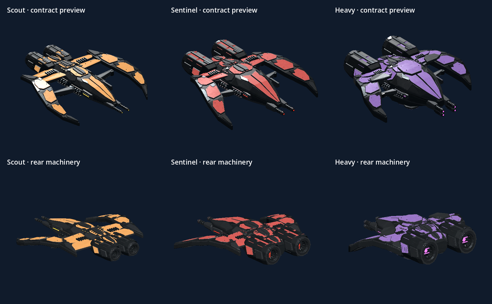

# Dorbit alien model review

Editable Scout, Sentinel and Heavy spacecraft built from the
[approved concept sheets](concepts/README.md), with interlocking contoured armor,
exposed hydraulic wing mounts, plated drives, recessed turbine nozzles,
ribbed forward cannons and armored sensor slits. This detail revision replaces
the first pass's regular flat tiles and plain drive housings with polygonal coat
panels, lapped chine blades, seam locks, service bays, cooling louvers and socket
fasteners. Wear follows the actual armor outlines in the surface maps.
The Scout retains narrow amber armor and long crescent wings; the crimson
Sentinel has a broader wedge hull and angular talons; the violet Heavy adds
reinforced shoulders, thicker armor and a substantial ventral block.
Its raised command shield overlaps the upper armor, while its talons are shorter
and its cannons have two complete paired barrels. Scout exhausts use circular
emitters, Sentinel uses vertical grilles, and Heavy uses violet crossbars.


| Alien | Editable model | Portable export | Six model views | Concept comparison |
| --- | --- | --- | --- | --- |
| Scout | [Blender](models/scout.blend) | [GLB](exports/scout.glb) | [Views](previews/scout-views.jpg) | [Compare](previews/scout-comparison.jpg) |
| Sentinel | [Blender](models/sentinel.blend) | [GLB](exports/sentinel.glb) | [Views](previews/sentinel-views.jpg) | [Compare](previews/sentinel-comparison.jpg) |
| Heavy | [Blender](models/heavy.blend) | [GLB](exports/heavy.glb) | [Views](previews/heavy-views.jpg) | [Compare](previews/heavy-comparison.jpg) |

Actual mesh close-ups: [Scout](previews/scout-details.jpg),
[Sentinel](previews/sentinel-details.jpg), [Heavy](previews/heavy-details.jpg).
Each sheet shows armor, a wing mount and a rear drive.

All renders come from the saved models in Blender, rather than image generation.
Each model has six full-view cameras: perspective, top, side, front, rear and
underside, plus three detail cameras for armor, mounts and drives. The `.blend`
opens with the perspective camera active; F12 renders
that view. Middle-drag orbits, the wheel zooms, and Home frames the craft.
Collections separate hull armor, wings, drives, weapons and sensors. The approved
concept is packed into the hidden References collection. Fine part shapes,
joint construction, panel depths and conflicting generated views are resolved
in the authored mesh.

## Materials and exports

Each craft has three 4096 x 4096 surface maps under `materials/<alien>/`:

- `albedo.png`: sRGB armor colors, multiscale coating variation, brushed grain,
  polygon-edge chips, seam grime, pits and directional service scratches.
- `orm.png`: red is 1 (no AO bake), green roughness, blue metallic.
- `normal.png`: tangent-space +Y micrograin, with no baked lighting.

The component manifest records atlas tiles, material roles and finish values.
Large fitted armor parts retain unique tiles. Repeated small fittings share
material finish tiles to preserve texture resolution on the visible plating.
Coated armor is distinct from exposed titanium, graphite structure and recessed
machinery. Sensor and exhaust emission use separate material surfaces, with
constant emission colors rather than painted glow. The normal maps contain
fine grain; armor gaps and chamfers are modeled geometry.

The maps and concept image are packed into each Blender file. The GLB embeds
all three maps and contains one mesh with material surfaces, reduced bevel
tessellation, UVs and normals. It includes no studio lights, cameras or references.
These files work without the original workspace or external texture paths.

Blender models use -Y forward and +Z up, in review units. GLB uses the standard
glTF Y-up conversion; importing it back into Blender restores the review axes
and dimensions. These exports preserve review units. Derived game exports live
under [assets/aliens](../../assets/aliens), centered with -Z forward and +Y up.
They retain the previous Scout/Sentinel/Heavy visual bounding diameters
(7.548/9.702/13.516 m) independently of the unchanged 2.2 m collision sphere.
Flight and contract previews share one mesh per type, seven material surfaces,
three shared 2K maps and Godot-generated distance LODs. The runtime maps average
albedo in linear space and renormalize normal vectors; the 4K sources remain
intact. Server-only aliens do not load these visual assets.

The shared Godot model factory adds textured emission to the colored armor for
readability against the sector nebula, including shadowed faces with bloom off.
It shares the albedo atlas; dark structure, recesses and sensor/exhaust finishes
remain distinct. This game visibility adjustment leaves the Blender source
materials intact.



The existing `art/.gdignore` excludes this source collection from Godot's imports.
Alien statistics, combat, collision geometry and destruction sizes are unchanged.
Representative-hardware performance still requires playtesting.

## Rebuilding and validation

Run from the repository root with Blender 5.2.2 LTS:

```powershell
rtk proxy "C:/Program Files/Blender Foundation/Blender 5.2/blender.exe" --background --factory-startup --python-exit-code 1 --python art/alien-review/build_models.py
rtk proxy "C:/Program Files/Blender Foundation/Blender 5.2/blender.exe" --background --factory-startup --python-exit-code 1 --python art/alien-review/validate_models.py
rtk proxy "C:/Program Files/Blender Foundation/Blender 5.2/blender.exe" --background --factory-startup --python-exit-code 1 --python tools/export_aliens.py
$alienSheetPython = rtk proxy python -c "import sys; print(sys.executable)"
rtk proxy uv pip install --python $alienSheetPython --target .tools/art-python pillow
rtk proxy python art/alien-review/build_review_sheets.py
```

If `rtk` is unavailable, run the same commands directly (prefix the quoted
Blender executable with `&` in PowerShell). Append `-- Scout`, `-- Sentinel` or
`-- Heavy` to the builder to rebuild selected craft. `-- Scout --draft` creates
only small perspective/top studies; rebuild without `--draft` before delivery.
The builder authors reference-specific geometry in
[alien_geometry.py](alien_geometry.py) and reuses the
[ship geometry helpers](../ship-review/build_models.py)
and [portable surface atlas](../../tools/ship_surface_atlas.py). The approved
concepts are inputs and remain unchanged when rebuilding.

[Build statistics](build-stats.json) record component and export geometry counts.
[Model validation](validation.json) covers reopened Blender files, finite
nondegenerate geometry, active atlas UVs, packed maps, nine final renders,
single-mesh GLB round trips and unobstructed emissive rear exhaust centers.
[Render validation](render-validation.json) checks
all twenty-seven 1600 x 1200 PNGs for nonempty images and checks the eighteen
full views for sufficient boundary clearance. Detail views intentionally crop
the craft. The sheet builder composes six-view sheets, three close-ups per craft,
concept comparisons and the overview from those renders.

Runtime [export statistics](../../assets/aliens/export-stats.json) record geometry,
orientation, dimensions and texture resolution. After Godot import,
`tests/alien_assets_test.gd` checks all three models, shared preview resources,
material maps, generated LODs, server isolation and destruction/respawn. Both
check suites and the Windows exported-pack build run it. Run Godot with
`--path . --script res://tools/render_alien_preview.gd` for fresh actual game
preview captures, and `res://tests/flight_playthrough.gd` for the rendered
hunt-and-repair replay.
Append `-- --sector` to the preview command to compare all three aliens at
25 m and 90 m against the game's sky and lighting. This writes
`build/validation/alien-visibility-sector.png`.

On 8 October 2026, all 172 source and exported-pack alien checks passed, together
with the full Windows suite and Windows build checks. The actual Godot preview
gallery and 960 × 600 contract board were visually inspected. The rendered
contract replay passed all 28 checks, including three Scout kills, automatic
payment, station repairs, repeat acceptance, equipment fitting and restart.
Its test-only server keeps Scout respawns nearby; full-sector randomized
navigation remains covered separately. The rendered
2560 × 1440 hunt-and-repair replay passed with 16.49 ms average and 21.70 ms p95
frame time on AMD Radeon(TM) Graphics. This is a local validation measurement,
not a representative friend-group hardware benchmark. Existing scene UID fallback
and test-exit ObjectDB warnings remain outside this art integration.
