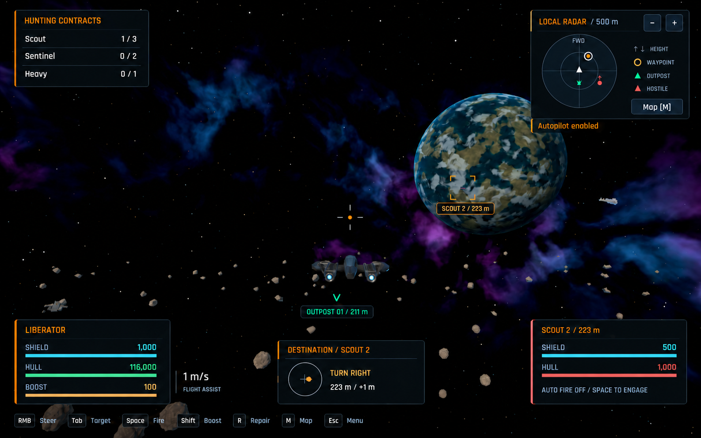

# Approved flight HUD design

Use the [shared menu colors, typography and minimal-text rules](../menu-design/README.md#shared-direction).
This final user-approved concept removes the full-width header and aligns the
upper panels at a small shared top margin. It illustrates presentation, not
current game values or validated runtime layout.

## Layout and feedback requirements

- Top-left active-contract progress and top-right forward-up radar share a
  small top margin (approximately 24 pixels in the reference).
- Radar retains range controls, contact height arrows, Map and an active-only
  autopilot label below it.
- Ship status, destination compass and target status align along the bottom;
  configured control hints sit on a quiet bottom strip. Leave the center open.
- Omit the full-width header, logo, header outpost label, cargo/pilot counts and
  wallet. Do not add the docked sidebar or Start action.
- Preserve cyan shields, green healthy hull/friendly contacts and red hostile
  hull/danger, alongside the shared graphite and amber palette.
- Retain contextual solo objectives, repair/station actions, cargo FULL, firing
  blockers, contact selection, notifications, radiation/re-entry, rescue,
  disconnected state and optional performance feedback.
- Keep long labels and values readable at 960 x 600, 1440 x 900 and 1920 x 1080.
  Native implementation must validate layout and interactions at those sizes.

World details and example progression are illustrative. This concept requests
no new ship/environment art or gameplay tuning.

## Generation provenance

Built-in ImageGen used [the existing flight screenshot](../feedback/autopilot-1440.png),
[the approved Overview](../menu-design/main-menu-approved.png) and
[its native implementation capture](https://github.com/Timerk/Dorbit/blob/3a6f3f66cfcac6173a313b3e2a9254c87872c1b9/docs/menu-design/overview-implemented.png)
as references. The exact [generation prompt](flight-hud-generation-prompt.txt),
[header-removal edit](flight-hud-header-removal-prompt.txt) and
[top-alignment edit](flight-hud-top-alignment-prompt.txt) are preserved. The edits
supersede the original header and panel-position instructions.

Only the final approved image is retained. This directory is excluded from
Godot imports with `.gdignore`.
