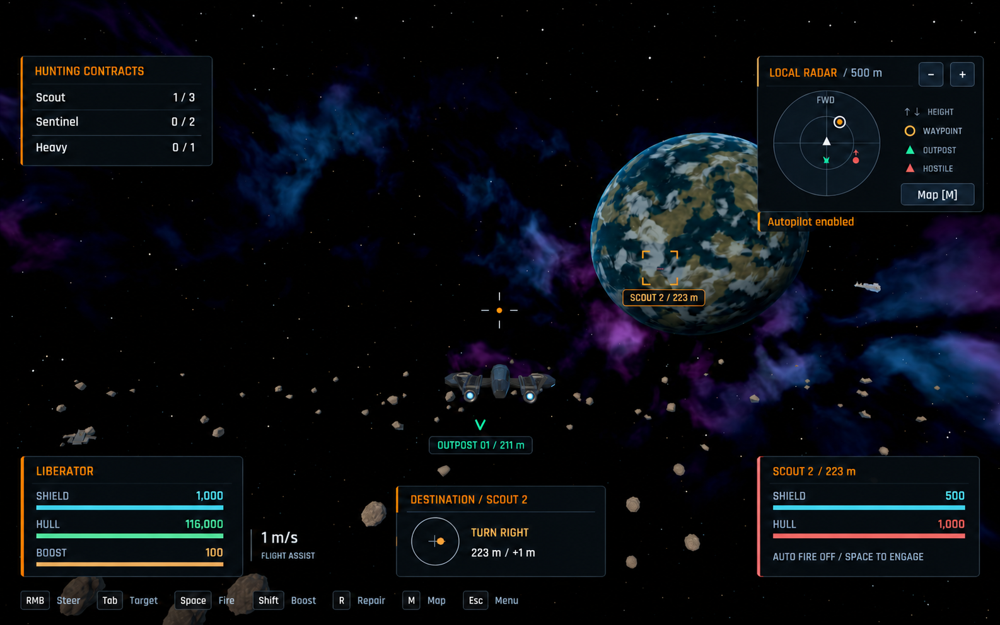

# Flight HUD concept

Revised proposal for the user's requested HUD redesign. Pending user review;
this is a generated reference image, not an implemented or approved screen.
No gameplay code or agreed game-plan requirements change in this branch.

## References

- [PR 41](https://github.com/Timerk/Dorbit/pull/41) records the approved menu
  concepts: graphite surfaces, restrained amber accents, condensed typography,
  concise labels and existing functionality.
- [PR 42](https://github.com/Timerk/Dorbit/pull/42) implements that direction.
  Its [Overview screenshot](https://github.com/Timerk/Dorbit/blob/3a6f3f66cfcac6173a313b3e2a9254c87872c1b9/docs/menu-design/overview-implemented.png)
  is the primary style reference. Its current header omits the docked-status
  block shown in the older concept.
- [The existing flight screenshot](../feedback/autopilot-1440.png) supplies the
  gameplay scene, HUD functions and panel arrangement.

## Proposed presentation

Use graphite `#0c1217` panels, thin slate `#34434b` borders, amber `#ff880b`
brand/action accents, off-white `#e3edf7` text and muted `#93a5b5` labels.
Match PR 42's Rajdhani font during implementation. Preserve semantic cyan
shields, green healthy hull/friendly contacts and red hostile hull/danger.

Retain the top-right forward-up radar, its range controls, contact height
arrows, Map action and small active-only autopilot label. Keep ship status,
destination compass and target status along the bottom, with aligned bottom
edges. Put concise active-contract progress at top left and control hints on a
quiet bottom strip. Leave the central flight view open.

Following user review, remove the entire full-width header and extend the space
background to the top edge. The logo, header outpost label, cargo count, pilot
count and wallet are removed from this concept without relocating them. Keep
the remaining HUD panels in place. No docked menu sidebar or Start action appears.

Numbers illustrate existing game states; they do not change starter ownership,
prices, tuning or saved progression. Three contracts show concurrent progress.
The original screenshot's world is the reference; any generated differences in
ship/environment details are illustrative and do not request new runtime art.

Implementation must retain contextual feedback not shown in this single state:
solo objectives, repair and station actions, cargo FULL, all firing blockers,
contact identity/selection, notifications, radiation and safe-reentry guidance,
rescue, disconnected state and optional performance overlay. Control hints must
use configured bindings. Long labels and values must remain readable at the
supported 960×600, 1440×900 and 1920×1080 window sizes. This image establishes
visual direction; it does not validate native layout or interactions.

## Generation and checks

Generated with the built-in ImageGen tool using the three referenced local
images: existing flight screenshot, PR 42 implemented Overview, and PR 41
approved main-menu concept. The [original prompt](flight-hud-generation-prompt.txt)
is saved alongside the image. A subsequent built-in ImageGen edit removed the
header at the user's request; its [exact edit prompt](flight-hud-header-removal-prompt.txt)
supersedes the original prompt's header instruction. This directory is excluded
from Godot imports.

Visually inspected the concept for graphite/amber styling, retained health,
radar/navigation/target/contract information, aligned bottom panels and header
removal. PNG integrity and documentation/diff checks apply. Gameplay and runtime layout
testing belong to the subsequent implementation, after concept review.
