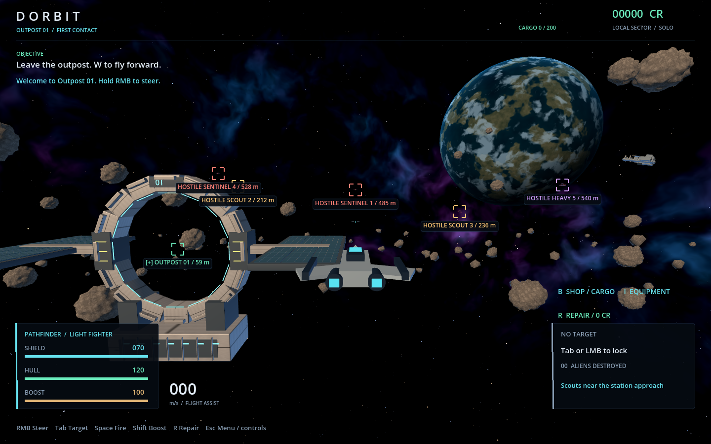
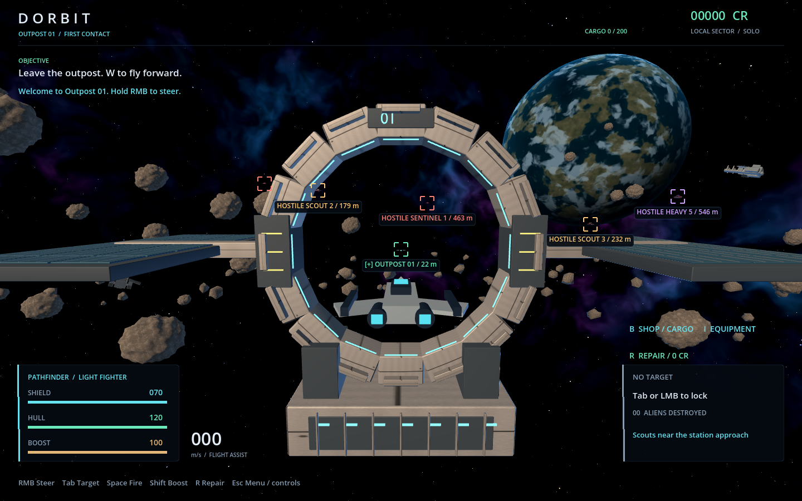
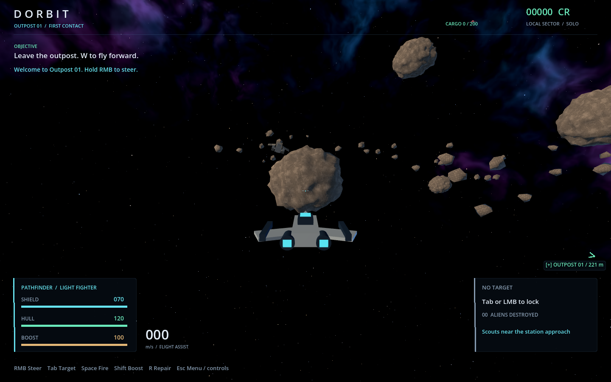

# Outpost 01 environment validation

Validated on Windows with Godot 4.7.2, the GL Compatibility renderer and an
AMD Radeon(TM) Graphics adapter. The original artwork is documented in
[assets/sector](../../assets/sector/README.md).

## In-game views







The rendered sector fixture also inspects the station approach, outer hunting
grounds and the reverse view. These use the real scene, camera and HUD. Distant
freighters and the instanced belt are decorative and outside the flight boundary.

## Checks

- `powershell -ExecutionPolicy Bypass -File tools/dev.ps1 check`: passed the full
  Windows suite, including ten-client dedicated-server combat, persistence,
  equipment, resource cargo/sales, connection/settings menus and the flight replay.
- `sector_visuals_test.gd`: 55 checks passed. Rendered clients and dedicated servers
  have identical collision geometry, including the original seeded 24 rock positions
  and radii plus six station colliders. The docking center remains clear; station
  structure still blocks rays. The server creates no meshes, lights or environment.
- Rendered `flight_playthrough.gd`: zero failures at a verified 2560 x 1440.
  Click/Tab targeting, firing feedback, blocked shots, shield/hull impacts, a Scout
  kill, its 30-credit reward, return and repair passed. The fixture sets its render
  size after saved graphics settings load and moves the cursor before injecting
  the click, matching how the game reads selection input.
- `powershell -ExecutionPolicy Bypass -File tools/dev.ps1 build`: Windows export
  passed; source and exported client protocol fingerprints match.
- `git diff --check`: passed.

The 1440p replay sampled 870 frames with VSync disabled: average 13.48 ms
(approximately 74 FPS), p95 16.23 ms. This is one local automated hunt on this
machine, not a ten-player performance guarantee or a balance playtest. The
alien movement fixture emitted its existing collinear-up-vector warning; the
replay completed without errors. Headless checks also emit existing ObjectDB
cleanup warnings.

The separate [sector frame report](render-report.json) records the 240-frame
1440 x 900 sample: approximately 157 FPS, p95 9.23 ms, VSync disabled and 4x MSAA.

The first full-suite attempt missed the alien test's fixed 500 ms admission
deadline while a separate renderer was running. That test passed in isolation,
then the complete suite passed with no concurrent render workload.

## Reproduce

Run renders sequentially, using a disposable APPDATA directory so the fixture does
not overwrite player graphics preferences:

```powershell
$env:APPDATA = Join-Path $PWD 'build/sector-art-profile'
& '.tools/godot/Godot_v4.7.2-stable_win64_console.exe' --path . --script res://tests/sector_art_preview.gd
& '.tools/godot/Godot_v4.7.2-stable_win64_console.exe' --path . --script res://tests/flight_playthrough.gd
```

The sector fixture saves six screenshots and `render-report.json` under
`build/validation/sector-art`. Its frame sample has five patrolling aliens at
1440 x 900 with 4x MSAA. The gameplay replay saves its screenshots under
`build/validation`. These fixtures do not require a production server or pilot
credentials. Linux checks were added to `tools/server.sh`; they were not run locally.
The workspace `rtk` wrapper was unavailable, so the local commands used PowerShell
directly.
